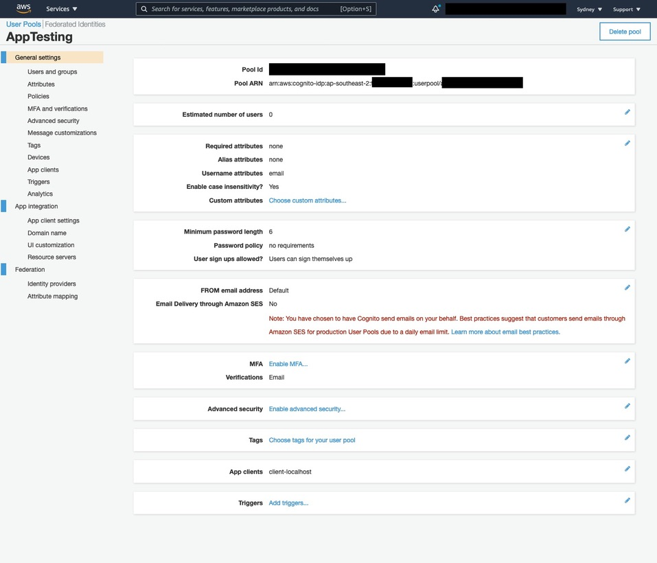
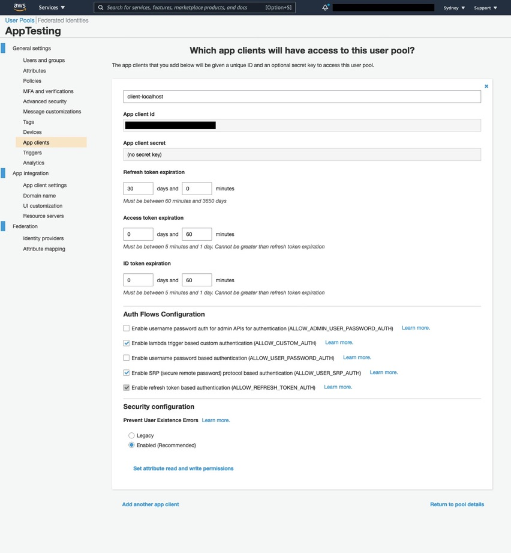
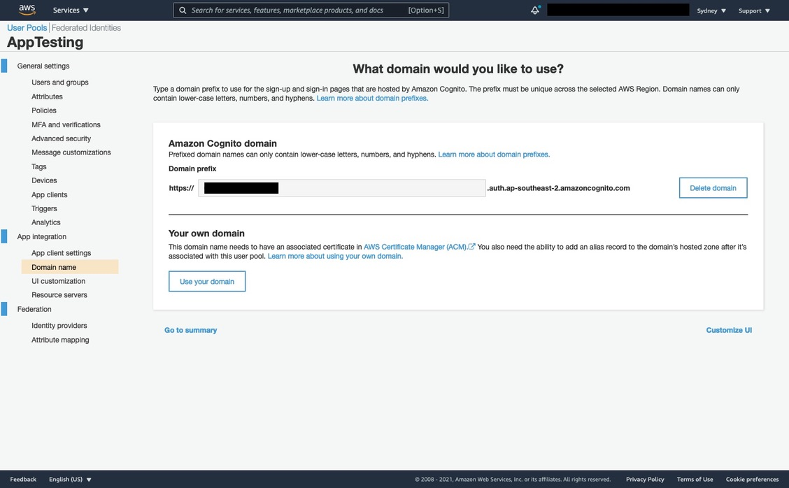
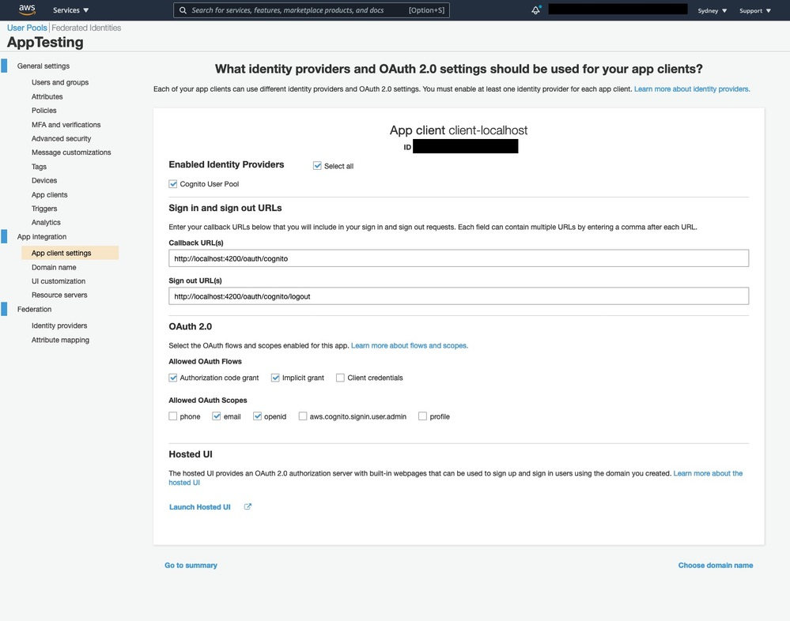

# Using Amazon Cognito OAuth Server instead of AWS-SDK with Node.js

Amazon Cognito Hosted UI provides you an OAuth 2.0 compliant authorization server. In this repository you can find a working example using [Amazon Cognito User Pools Auth API Reference](https://docs.aws.amazon.com/cognito/latest/developerguide/cognito-userpools-server-contract-reference.html).

We take advantage of Amazon Cognito OAuth Domain Name to exchange tokens and access user information in our Amazon Cognito User Pool.

**Note:** If you want to update the user attributes in the user pool, you still need to build / provite a CRUD API using [AWS-SDK](https://docs.aws.amazon.com/sdk-for-javascript/v3/developer-guide/getting-started-nodejs.html). This is out of the scope of this article.

# User Pool Configuration

The example above assumes a few things:

- There's NO MFA CONFIGURED in the Cognito User Pool
- There's EMAIL VERIFICATION by the Cognito User Pool (e.g. you need a valid email in the sign up process)
- Password policy is "Minimum length: 6" only (e.g. numbers, special character verification are turned off)

## General settings

- Pool Id - REDACTED (Unique to you)
- Poolr ARN - REDACTED (Unique to you)
- Required attributes - none
- Alias attributes - none
- Username attributes - email
- Enable case insensitivity? - Yes
- Custom Attributes - none
- Minimum password length - 6
- Password policy - no requirements
- User sign ups allowed? - Users can sign themselves up
- FROM email address - Default
- Email Delivery through Amazon SES - No
- MFA - Disabled
- Verifications - Email
- Advanced security - none
- Tags - none
- App clients - client-localhost
- Triggers - none

## General settings > App clients

We configured **ONE app client to work with localhost urls**.

You can create multiple app clients to work with different environments (e.g. web-client, mobile-client, qa-client etc).

Configuration used when creating the app client:

- App client name - client-localhost
- Refresh token expiration - I kept default values (30 days and 0 minutes)
- Access token expiration - I kept default values (0 days and 60 minutes)
- ID token expiration - I kept default values (0 days and 60 minutes)
- **IMPORTANT** Generate client secret - Uncheck/Turn off this checkbox
- Auth Flows Configuration - I kept default values (values selected are: `ALLOW_CUSTOM_AUTH`, `ALLOW_USER_SRP_AUTH`, `ALLOW_REFRESH_TOKEN_AUTH`)
- Security configuration
  - > Prevent User Existence Errors - I kept default values (checkbox for "Enabled (Recommended)" checked/turned on)
- Click "Create app client"

After the app client is created copy the unique **App client id** into `.env` on `COGNITO_CLIENT_ID=` variable.

## App integration > Domain name

Navigate to `App integration > Domain name` and check the availability of a Amazon Cognito domain. It will generate our OAuth 2.0 compliant authorization server.

You can also use your own domain for the authorization server, check the [documentation for more instructions](https://docs.aws.amazon.com/cognito/latest/developerguide/cognito-user-pools-add-custom-domain.html).

- Domain prefix - REDACTED (Unique to you)

## App integration > App client settings

Now we need to define OAuth flows and scopes for the App Client we created before (e.g. `client-localhost`). You can [learn more about App Client Settings Terminology in the documentation.](https://docs.aws.amazon.com/cognito/latest/developerguide/cognito-user-pools-app-idp-settings.html#cognito-user-pools-app-idp-settings-about)

- ID - REDACTED (Unique to you)
- Enabled Identity Providers - Check/turn on "Select all" checkbox
- Sign in and sign out URLs
  - > Callback URL(s) - http://localhost:4200/oauth/cognito
  - > Sign out URL(s) - http://localhost:4200/oauth/cognito/logout
- OAuth 2.0
  - > Allowed OAuth Flows - Check/turn on "Authorization code grant" and "Implicit grant" checkboxes
  - > Allowed OAuth Scopes - Check/turn on "email" and "openid" checkboxes

# To the moon 🚀

You are ready to run this example, make sure to:

1. Copy `.env.example` to `.env` and udpate ALL variables values
2. Run `npm install`
3. Start the example with `npm start`

If you have any questions you can reach out via [twitter/oieduardorabelo](https://twitter.com/oieduardorabelo).
